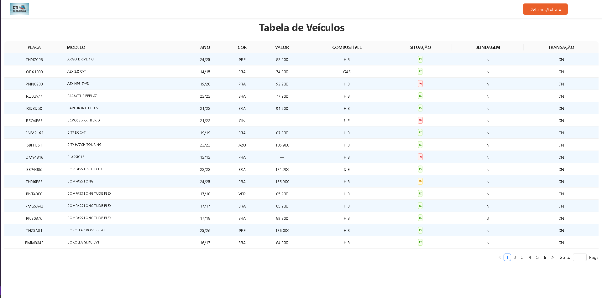

🧩 DTI Front

📖 Descrição

O DTI Front é uma amostra de site para padronização de tabela com dados de veículos.
Projeto freelance desenvolvido em parceria com meu sócio, utilizando o CNPJ da empresa DTI.

Atualmente está em Create React App, o que deixa o ambiente de desenvolvimento mais lento no localhost.
👉 Em breve será migrado para Vite, garantindo muito mais performance.

---

 🎮 Preview  

👉 [Jogar agora na Vercel](https://site-tabela-dti-frontend.vercel.app/)

---

⚡ Funcionalidades

Exibição de tabela de veículos.

Padronização de dados de entrada.

Interface simples para consulta.

Base para futuros ajustes e expansão.

---

📚 Conceitos praticados

Organização e padronização de dados.

Estruturação de projeto em React.

Separação de componentes reutilizáveis.

Estilização modular.

---

🛠️ Tecnologias

React (Create React App)

JavaScript (ES6+)

HTML5 & CSS3

---

🚀 Como usar

Clone o repositório:

	git clone https://github.com/Matheus-TecDev/DTI-Front.git

Acesse a pasta do projeto:

	cd frontend

Instale as dependências:

	npm install

Rode o projeto localmente:

	npm start

📍 O projeto abrirá em http://localhost:3000

---

🤝 Contribuição

Sugestões de melhorias são muito bem-vindas!

Abra uma issue para relatar bugs ou propor ideias.

Envie um Pull Request com suas contribuições.

---

📌 Roadmap (versões futuras)

🔄 Migrar de Create React App → Vite.

📱 Melhorar responsividade.

📊 Criar novas visualizações de dados.

---

👨‍💻 Autores

- [Matheus Freire](https://github.com/Matheus-TecDev)  
- [LinkedIn](https://www.linkedin.com/in/matheus-freire-martins-da-costa-318622376/) 
 
📫 Contato: matheus.tecnodev@gmail.com

🤝 Projeto desenvolvido em parceria com DTI.
